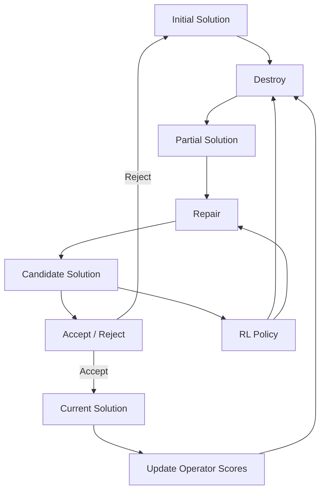

# RL-Enhanced Large Neighborhood Search for VRPTW


A research-oriented study of **Vehicle Routing Problem with Time Windows (VRPTW)** on Solomon benchmarks, comparing classical **Adaptive Large Neighborhood Search (ALNS)** with a **reinforcement learning–guided Large Neighborhood Search (NLNS)**.

**Main finding:** a hybrid **NLNS → ALNS refinement** pipeline gives the strongest overall performance, while keeping all benchmark solutions feasible.

---

## Problem

VRPTW is a capacitated routing problem in which each customer must be served:

* exactly once,
* within a predefined **time window**,
* using vehicles with limited capacity,
* with all routes starting and ending at a depot.

We evaluate on the standard **Solomon 100-customer benchmark instances** using the common hierarchical objective:

1. minimize the number of vehicles,
2. then minimize total travel distance.

---

## Method

### ALNS

A destroy-and-repair metaheuristic that repeatedly:

* removes a subset of customers,
* repairs the partial solution using heuristic insertion rules,
* adapts operator choice based on past performance.

### NLNS

A learned version of large neighborhood search in which a **policy-gradient agent** guides the search decisions instead of relying only on handcrafted operator selection.

### Hybrid

A two-stage pipeline:

* **NLNS** explores promising neighborhoods,
* **ALNS** refines the final solution.

---

## Search loop



---

## Results

### Benchmark summary


The hybrid approach consistently improves over the ALNS baseline and the learned NLNS variant.

| Method                 | Mean Obj. ↓ | Gain % ↑ | Win Rate ↑ |  Routes ↓ |  Distance ↓ | Runtime (s) ↓ |
| ---------------------- | ----------: | -------: | ---------: | --------: | ----------: | ------------: |
| ALNS                   |     9954.01 |     0.00 |       0.00 |     14.28 |     5389.67 |          3.20 |
| NLNS                   |     9358.80 |     3.34 |       0.56 |     13.67 |     5272.24 |          3.13 |
| Hybrid_default         |     9122.60 |     5.85 |       0.67 |     13.94 |     5301.23 |          3.84 |
| **Hybrid_low_destroy** | **8794.96** | **8.63** |   **0.83** | **13.78** | **5349.12** |      **3.18** |

**Best configuration:** `Hybrid_low_destroy`

### Route examples


### Learning curve


---

## Key contributions

* RL-guided large neighborhood search for VRPTW
* Hybrid NLNS → ALNS refinement strategy
* Full benchmark pipeline on Solomon instances
* Systematic ablation of search configurations

---

## Ablation study

We compare the main hybrid variants below.

| Variant               | Description                  | Outcome                      |
| --------------------- | ---------------------------- | ---------------------------- |
| `Hybrid_default`      | Default hybrid pipeline      | Strong baseline              |
| `Hybrid_low_destroy`  | Lower destruction intensity  | **Best overall**             |
| `Hybrid_high_destroy` | Higher destruction intensity | More aggressive, less stable |
| `Hybrid_few_steps`    | Fewer search steps           | Faster, weaker               |
| `Hybrid_many_steps`   | More search steps            | Better search, slower        |

**Conclusion:** lower destruction intensity gives the best balance between exploration and stability.

---

## Reproducibility

### Setup

```bash
python3 -m venv venv
source venv/bin/activate
pip install -r requirements.txt
```

### Train NLNS

```bash
python3 main_nlns.py \
  --instances_dir data/train \
  --epochs 30 \
  --steps_per_episode 25 \
  --save_dir outputs/nlns
```

### Evaluate NLNS

```bash
python3 inference_nlns.py \
  --instances_dir data/test \
  --model_path outputs/nlns/checkpoints/final_model.pt \
  --output_dir outputs/nlns_eval
```

### Run ALNS baseline

```bash
python3 main.py \
  --instances_dir data/test \
  --alns_iterations 50
```

### Run hybrid pipeline

```bash
python3 inference_hybrid.py \
  --instances_dir data/test \
  --alns_json_dir outputs/test/instances_json \
  --model_path outputs/nlns/checkpoints/final_model.pt \
  --output_dir outputs/hybrid_eval
```

### Build benchmark report

```bash
python3 analysis/benchmark_report.py \
  --alns_csv outputs/test/test_summary.csv \
  --nlns_csv outputs/nlns_eval/nlns_summary.csv \
  --hybrid_csv outputs/hybrid_eval/hybrid_summary.csv \
  --output_dir analysis_outputs/benchmark_3way
```

---

## Project structure

```text
├── data/                 # Solomon instances
├── docs/figures/         # README figures
├── src/                  # Core implementation
│   ├── alns/
│   ├── nlns/
│   ├── operators/
│   └── utils/
├── analysis/             # Benchmark + visualization
├── outputs/              # Generated results (ignored)
├── notebooks/            # Experiments
└── README.md
```

---

## Notes

* Generated outputs are excluded via `.gitignore`
* Benchmark scripts assume standard Solomon format
* All experiments are fully reproducible

---

## References

* Solomon benchmark instances for VRPTW
* Ropke & Pisinger (2006) — Adaptive Large Neighborhood Search
* Neural Large Neighborhood Search and RL-based routing literature
